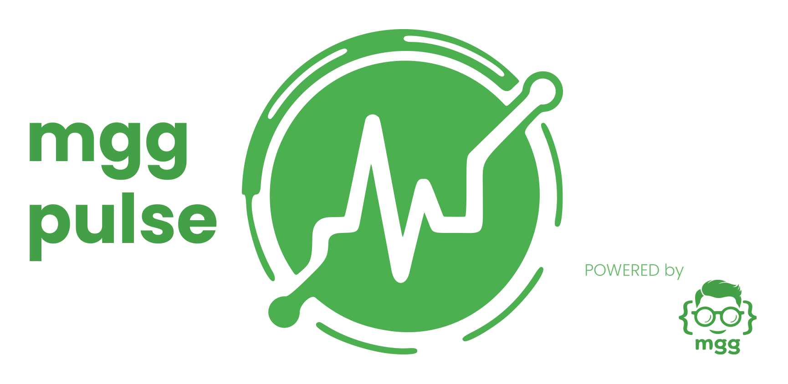
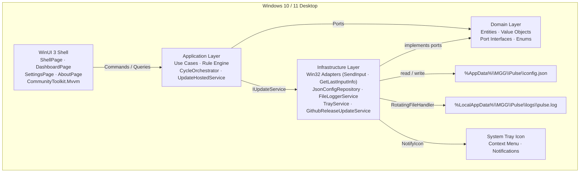

[](./app/build/latest.json)
[](https://dotnet.microsoft.com/)
[](https://learn.microsoft.com/en-us/windows/apps/winui/winui3/)
[](./LICENSE)
[](https://www.microsoft.com/windows/)
[](./app/tests/MGG.Pulse.Tests.Unit)

Windows desktop app that prevents session timeouts in remote environments (RDP, VDI, Citrix) by simulating minimal, non-intrusive user input only when the user is genuinely idle. Runs silently via System Tray, fully configurable, with a shell-based WinUI 3 UI.

---

## Architecture

MGG Pulse is a **Hexagonal (Ports & Adapters) + MVVM** application structured in four discrete layers. The dependency rule flows strictly inward — `UI → Application → Domain`. Infrastructure implements Domain ports. Domain has **zero** external dependencies.



> Full layer diagrams, sequence flows, and file map → [`ARCHITECTURE.md`](./ARCHITECTURE.md)

---

## Features

### Core Simulation

| Feature | Description |
|---------|-------------|
| **Intelligent Mode** | Simulates input only when idle time exceeds the configured threshold |
| **Aggressive Mode** | Always simulates, regardless of user activity |
| **Manual Mode** | Fixed-interval simulation |
| **Safe simulation** | Mouse moves 1–2 px; keyboard uses Shift/Ctrl — never disrupts work |
| **Rule Engine** | `IdleRule`, `AggressiveModeRule`, `IntervalRule` evaluated per cycle |

### Shell & Navigation

| Feature | Description |
|---------|-------------|
| **Shell Navigation** | WinUI 3 `NavigationView` — Dashboard / Settings / Appearance / Logs / About |
| **System Tray** | Runs silently in background; show/hide, start/stop, quit from tray |
| **Splash Screen** | Large logo-first branded launch with 5-second minimum display |
| **Dark / Light theme** | Dedicated Appearance page with persisted Light / Dark toggle |

### Settings & Persistence

| Feature | Description |
|---------|-------------|
| **Persistent config** | Saves to `%AppData%\MGG\Pulse\config.json` — survives updates |
| **Real-time logs** | Dedicated Logs page with in-session continuity |
| **Settings page** | All config controls isolated from the Dashboard |

### Auto-Updater

| Feature | Description |
|---------|-------------|
| **Startup check** | Passive update check on launch — non-blocking, no popups |
| **Periodic check** | Every 4 hours via `UpdateHostedService` background timer |
| **Manual check** | Trigger from About page; shows loading state and explicit result |
| **Silent install** | Downloads installer to `%TEMP%`, runs `/SILENT`, exits cleanly |
| **`latest.json`** | Committed on `main` (`app/build/latest.json`); schema: `version`, `url`, `sha256`, `notes` |

### About Screen

| Feature | Description |
|---------|-------------|
| **App version** | Reads from assembly — always accurate after build |
| **Changelog link** | Opens `CHANGELOG.md` on GitHub |
| **Manual update check** | Inline loading state + result message |

---

## Installation

### Option A — Installer (recommended for end users)

> **Prerequisites**: .NET 8 Desktop Runtime, Windows App SDK 1.5+ (bundled in installer).

1. Download `MGGPulse-Setup-1.3.4.exe` from [Releases](https://github.com/mgg-171093/mgg-pulse/releases)
2. Run the installer — **no admin / UAC required** (installs per-user by default)
3. The app installs to `%LocalAppData%\MGG\Pulse\`
4. Launch **MGG Pulse** from the Start Menu or Desktop shortcut

On first launch the splash screen appears, then the shell opens. Minimizing sends the app to the System Tray.

### Option B — Build the installer yourself

See [Building the Installer](#building-the-installer) below.

### Option C — Run from source (development)

See [Development Quick Start](#development-quick-start) below.

---

## Building the Installer

To produce `MGGPulse-Setup-{version}.exe` from source, you need the full dev environment plus two build tools.

### Prerequisites

| Tool | Version | Install |
|------|---------|---------|
| .NET SDK | 8.0+ | [dotnet.microsoft.com](https://dotnet.microsoft.com/download) |
| Windows App SDK | 1.5+ | Installed via NuGet — no separate install |
| ImageMagick | Any recent | [imagemagick.org](https://imagemagick.org/script/download.php) — optional, for icon generation |
| Inno Setup | 6.x | [jrsoftware.org/isdl.php](https://jrsoftware.org/isdl.php) |

### Run the build

```powershell
# From the app/ directory — full pipeline (dotnet publish → icon gen → Inno Setup)
pwsh -File build/build.ps1

# Override version
pwsh -File build/build.ps1 -Version 1.3.4

# Skip icon generation (if ImageMagick is not installed)
pwsh -File build/build.ps1 -SkipIco
```

The script (`app/build/build.ps1`):
1. Reads `<Version>` from `src/MGG.Pulse.UI/MGG.Pulse.UI.csproj`
2. Runs `dotnet publish` → `win-x64`, Release, framework-dependent → `build/publish/`
3. Calls `tools/gen-icon.ps1` to generate `assets/branding/icon.ico` from `logo-main.png`
4. Runs Inno Setup (`app/build/pulse.iss`) → `build/output/MGGPulse-Setup-{version}.exe`

> **Note**: The installer uses `PrivilegesRequired=lowest` — no UAC prompt unless the user explicitly elevates.

---

## Development Quick Start

### 1 — Clone the repo

```bash
git clone https://github.com/mgg-171093/mgg-pulse.git
cd mgg-pulse
```

### 2 — Restore dependencies

```bash
cd app
dotnet restore MGG.Pulse.slnx
```

### 3 — Run (Visual Studio or Rider)

Open `app/MGG.Pulse.slnx`. Set `MGG.Pulse.UI` as startup project and press **F5**.

### 4 — Run (CLI)

```powershell
cd app
dotnet run --project src/MGG.Pulse.UI/MGG.Pulse.UI.csproj
```

> **Note**: WinUI 3 requires the Windows App SDK to be installed on the dev machine. Run `winget install Microsoft.WindowsAppSDK` if needed.

---

## Testing

```powershell
# All unit tests
cd app
dotnet test tests/MGG.Pulse.Tests.Unit

# Verbose
dotnet test tests/MGG.Pulse.Tests.Unit --logger "console;verbosity=detailed"

# Single test file / filter
dotnet test tests/MGG.Pulse.Tests.Unit --filter "FullyQualifiedName~CheckForUpdateUseCaseTests"
```

Tests cover Domain and Application layers using **xUnit + Moq**. Infrastructure and UI are excluded from automated tests (Windows-only Win32 adapters and WinUI 3 require a live desktop session).

---

## Tech Stack

| Layer | Technology | Version | Purpose |
|-------|-----------|---------|---------|
| UI | WinUI 3 | Windows App SDK 1.5+ | Desktop shell and views |
| UI | C# | 12 / .NET 8 | Language |
| UI | CommunityToolkit.Mvvm | 8.x | MVVM source generators (`ObservableObject`, `RelayCommand`) |
| UI | Microsoft.Extensions.DependencyInjection | 8.x | Composition Root in `App.xaml.cs` |
| Application | CheckForUpdateUseCase | — | Clean update check — decoupled from UI |
| Application | UpdateHostedService | — | Background 4-hour timer + startup check |
| Application | RuleEngine | — | IdleRule · AggressiveModeRule · IntervalRule |
| Domain | IUpdateService | — | Port for update adapter |
| Domain | IInputSimulator | — | Port for Win32 SendInput |
| Domain | IIdleDetector | — | Port for Win32 GetLastInputInfo |
| Infrastructure | GithubReleaseUpdateService | — | Fetches `latest.json` via `HttpClient` |
| Infrastructure | Win32InputSimulator | — | P/Invoke `SendInput` |
| Infrastructure | Win32IdleDetector | — | P/Invoke `GetLastInputInfo` |
| Infrastructure | JsonConfigRepository | — | `%AppData%\MGG\Pulse\config.json` |
| Infrastructure | FileLoggerService | — | Rotating log file |
| Infrastructure | SystemTrayService | — | `NotifyIcon` context menu |
| Build | Inno Setup | 6.x | Windows installer (no UAC) |
| Tests | xUnit | 2.x | Unit test framework |
| Tests | Moq | 4.x | Mock framework |

---

## Prerequisites (development)

| Requirement | Version | Notes |
|-------------|---------|-------|
| .NET SDK | 8.0+ | Target framework: `net8.0-windows10.0.19041.0` |
| Windows App SDK | 1.5+ | `winget install Microsoft.WindowsAppSDK` |
| Windows | 10 (1809+) or 11 | Target platform only |
| Visual Studio / Rider | Any recent | VS 2022 17.8+ recommended for WinUI 3 tooling |

---

## Data Paths

| What | Path |
|------|------|
| Config file | `%AppData%\MGG\Pulse\config.json` |
| Log file | `%LocalAppData%\MGG\Pulse\logs\pulse.log` |
| App install dir | `%LocalAppData%\MGG\Pulse\` (installer default) |
| Update manifest | `https://raw.githubusercontent.com/mgg-171093/mgg-pulse/main/app/build/latest.json` |
| Downloaded installer | `%TEMP%\MGGPulse-Setup-{version}.exe` (auto-deleted after install) |

Config in `%AppData%` is **never overwritten on upgrade** — your settings survive updates.

---

## Project Documentation

| File | Audience | Contents |
|------|----------|---------|
| [`ARCHITECTURE.md`](./ARCHITECTURE.md) | Devs / AI | Layer diagram, shell flow, update pipeline, file map |
| [`app/AGENTS.md`](app/AGENTS.md) | AI agents | Critical rules, domain concepts, coding conventions, skill registry |
| [`app/CHANGELOG.md`](app/CHANGELOG.md) | All | Version history, per-change summary |
| [`app/openspec/`](app/openspec/) | Devs / AI | SDD specs, proposals, designs, task lists |
| [`app/README.md`](app/README.md) | App devs | Build, test, and project structure reference |
| [`app/build/latest.json`](app/build/latest.json) | Release | Raw-main update manifest schema — auto-updated by `.github/workflows/release.yml` |
| [`app/build/pulse.iss`](app/build/pulse.iss) | Build | Inno Setup installer script |
| [`app/build/build.ps1`](app/build/build.ps1) | Build | Full release pipeline orchestrator |

---

## Contributing

Before touching any code, read [`app/AGENTS.md`](app/AGENTS.md) — it contains critical rules about architecture, coding conventions, and layer boundaries.

### Key constraints

| Rule | Detail |
|------|--------|
| **Domain zero-deps** | `MGG.Pulse.Domain` must have zero NuGet or project references — no exceptions |
| **No cross-layer leaks** | Never reference Infrastructure types from Application or Domain |
| **CancellationToken** | All Application-layer async methods must accept `CancellationToken` |
| **Result pattern** | Use `Result<T>` in Use Cases — no exceptions for expected failures |
| **UI threading** | Any background-thread result touching UI must use `DispatcherQueue.TryEnqueue` |
| **All tests must pass** | Run `dotnet test` after every change |

### Dev workflow

```powershell
# 1. Make your changes

# 2. Restore and build
cd app
dotnet restore MGG.Pulse.slnx
dotnet build MGG.Pulse.slnx

# 3. Run tests
dotnet test tests/MGG.Pulse.Tests.Unit

# 4. If adding new ports or use cases — update specs in openspec/
```

---

## License

[MIT](./LICENSE) © 2026 Manuel Garcia Gonzalez
